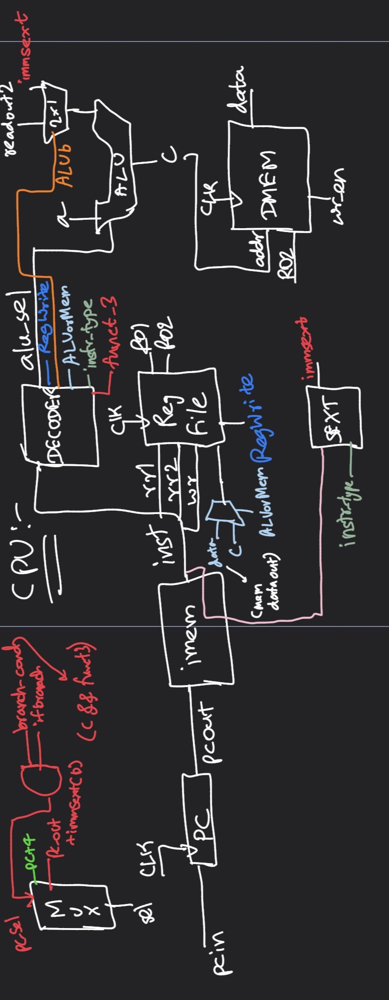

# cpu-from-scratch

Building processors from the ground up in Verilog, following Onur Mutlu's 
computer architecture lectures. This repo documents my journey implementing 
RISC-V processors incrementally — starting from single cycle, working towards 
pipeline and beyond.

## What's here

### riscv32i-single-cycle-core-processor
A fully functional RV32I single cycle processor implemented in Verilog.

### Architecture diagram (needs some updates)



Supports 35 instructions across all base RV32I formats:
- R-type: ADD, SUB, XOR, OR, AND, SLL, SRL, SRA, SLT, SLTU
- I-type ALU: ADDI, XORI, ORI, ANDI, SLLI, SRLI, SRAI, SLTI, SLTIU
- I-type Load: LW (LB, LH, LBU, LHU decoded, byte masking pending)
- S-type: SW
- B-type: BEQ, BNE, BLT, BGE, BLTU, BGEU
- J-type: JAL, JALR
- U-type: LUI, AUIPC

**Modules:**
- `program_counter.v` — plain register, next-PC mux logic in top module
- `instruction_mem.v` — synchronous ROM, loads from program.hex
- `register_file.v` — 32x32 regfile, x0 hardwired to zero
- `alu.v` — 10 operations
- `sign_extend.v` — handles all 5 immediate formats
- `decoder.v` — generates control signals from opcode/funct3/funct7
- `data_mem.v` — byte addressable, little endian
- `cpu.v` — top level, all datapath muxes and branch logic
- `testbench.v` — simulation testbench with $display output

**Verified with:**
- Basic ALU operations
- Signed/unsigned comparisons
- Store and load to data memory
- All 6 branch conditions with correct taken/not-taken behavior
- Loop program (sum 1 to N)

**To simulate:**
```bash
iverilog -o cpu_sim testbench.v cpu.v decoder.v alu.v register_file.v \
program_counter.v instruction_mem.v sign_extend.v data_mem.v
vvp cpu_sim
```

### riscv32i-multi-cycle-core-processor
Work in progress. Datapath design and stage breakdown documented in 
`thoughts.txt`.

## Reference
- Onur Mutlu — Computer Architecture Lectures, ETH Zurich
- Patterson & Hennessy — Computer Organization and Design
- RISC-V ISA Specification
